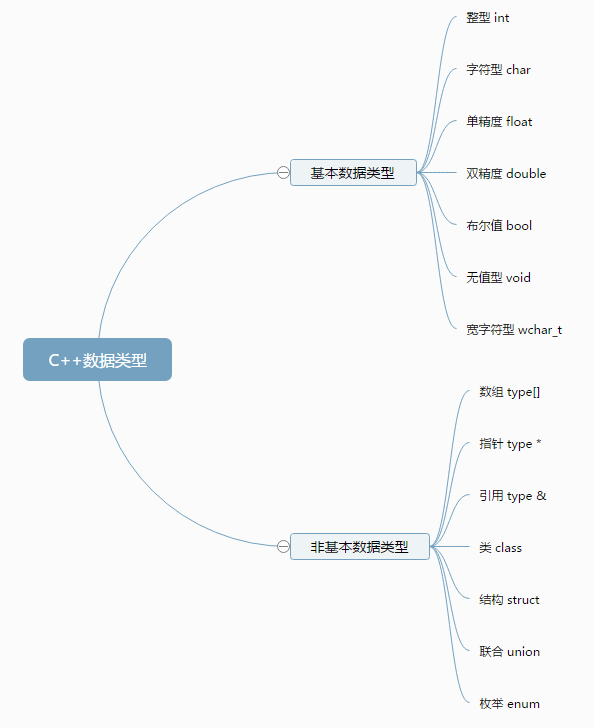

<!-- TOC -->

- [基本](#基本)
    - [数据类型](#数据类型)
        - [typedef 声明](#typedef-声明)
        - [枚举类型](#枚举类型)
        - [枚举拓展](#枚举拓展)
    - [变量类型](#变量类型)
        - [布尔值](#布尔值)
    - [数组](#数组)
        - [一维数组](#一维数组)
        - [多维数组](#多维数组)
        - [指向数组的指针](#指向数组的指针)
    - [指针](#指针)
        - [NULL指针和nullptr指针](#null指针和nullptr指针)
        - [数组指针](#数组指针)
        - [对地址的加1](#对地址的加1)
    - [函数](#函数)
        - [调用方式](#调用方式)
            - [值传递](#值传递)
            - [指针传递](#指针传递)
            - [引用传递](#引用传递)
            - [变量交换实例](#变量交换实例)
        - [内联函数](#内联函数)
    - [引用](#引用)
        - [引用vs指针](#引用vs指针)
        - [引用作为函数返回值](#引用作为函数返回值)
        - [函数模板](#函数模板)
    - [const](#const)
        - [const与基本数据类型](#const与基本数据类型)
        - [const与指针类型](#const与指针类型)
        - [const与引用类型](#const与引用类型)
        - [const与宏定义#define](#const与宏定义define)
            - [类型和安全检查方面](#类型和安全检查方面)
            - [编译器处理不同](#编译器处理不同)
            - [存储方式不同](#存储方式不同)
            - [定义域不同](#定义域不同)
    - [队列](#队列)
        - [普通队列](#普通队列)
        - [环形队列](#环形队列)
    - [结构体](#结构体)
        - [定义和声明](#定义和声明)
        - [结构体与类的区别](#结构体与类的区别)

<!-- /TOC -->

<a id="markdown-基本" name="基本"></a>
# 基本
<a id="markdown-数据类型" name="数据类型"></a>
## 数据类型

图中“type”表示任一种非void的类型



一些基本类型可以使用一个或多个类型修饰符进行修饰：
* signed
* unsigned
* short
* long

下表显示了各种变量类型在内存中存储值时需要占用的内存，以及该类型的变量所能存储的最大值和最小值。

类型 | 位 | 范围
---|---|---
char | 1 个字节 | -128 到 127 或者 0 到 255
unsigned char | 1 个字节 | 0 到 255
signed char | 1 个字节 | -128 到 127
int | 4 个字节 | -2147483648 到 2147483647
unsigned int | 4 个字节 | 0 到 4294967295
signed int | 4 个字节 | -2147483648 到 2147483647
short int | 2 个字节 | -32768 到 32767
unsigned short int | 2 个字节 | 0 到 65,535
signed short int | 2 个字节 | -32768 到 32767
long int | 8 个字节 | -9,223,372,036,854,775,808 到 9,223,372,036,854,775,807
signed long int | 8 个字节 | -9,223,372,036,854,775,808 到 9,223,372,036,854,775,807
unsigned long int | 8 个字节 | 0 to 18,446,744,073,709,551,615
float | 4 个字节 | +/- 3.4e +/- 38 (~7 个数字)
double | 8 个字节 | +/- 1.7e +/- 308 (~15 个数字)
long double | 8 个字节 | +/- 1.7e +/- 308 (~15 个数字)
wchar_t | 2 或 4 个字节 | 1 个宽字符

从上表可得知，变量的大小会根据编译器和所使用的电脑而有所不同。
下面实例会输出您电脑上各种数据类型的大小。

```cpp
#include <iostream>
using namespace std;

int main()
{
   cout << "Size of char : " << sizeof(char) << endl;
   cout << "Size of int : " << sizeof(int) << endl;
   cout << "Size of short int : " << sizeof(short int) << endl;
   cout << "Size of long int : " << sizeof(long int) << endl;
   cout << "Size of float : " << sizeof(float) << endl;
   cout << "Size of double : " << sizeof(double) << endl;
   cout << "Size of wchar_t : " << sizeof(wchar_t) << endl;
   return 0;
}
```

<a id="markdown-typedef-声明" name="typedef-声明"></a>
### typedef 声明
您可以使用 typedef 为一个已有的类型取一个新的名字。下面是使用 typedef 定义一个新类型的语法：
```cpp
typedef int newInt;
newInt width = 100;//等价于 int width = 100;
```

<a id="markdown-枚举类型" name="枚举类型"></a>
### 枚举类型
枚举类型(enumeration)是C++中的一种派生数据类型，它是由用户定义的若干枚举常量的集合。
如果一个变量只有几种可能的值，可以定义为枚举(enumeration)类型。所谓"枚举"是指将变量的值一一列举出来，变量的值只能在列举出来的值的范围内。
创建枚举，需要使用关键字 enum。枚举类型的一般形式为：
```cpp
enum 枚举名{ 
     标识符[=整型常数],
     标识符[=整型常数],
... 
    标识符[=整型常数]
} 枚举变量;
```

如果枚举没有初始化, 即省掉"=整型常数"时, 则从第一个标识符开始,依次次赋给标识符0, 1, 2, ...。
但当枚举中的某个成员赋值后, 其后的成员按依次加1的规则确定其值。

```cpp
#include "stdafx.h"
#include <iostream>
using namespace std;

enum Weeks
{
	周日,
	周一 = 1,
	周二 = 2,
	周三 = 3,
	周四 = 4,
	周五 = 5,
	周六 = 6,
}week;

int main()
{
	week = 周日;

	cout << week << endl;//0

	Weeks xingqi;
	xingqi = 周三;

	cout << xingqi << endl;//3

	system("pause");

	return 0;
}
```

<a id="markdown-枚举拓展" name="枚举拓展"></a>
### 枚举拓展
在使用enum直接定义枚举时，在同一个公共域下，即使枚举名称不同，枚举值也不可相同。

vc++11新特性
```cpp
enum class MyEnum{};
```

<a id="markdown-变量类型" name="变量类型"></a>
## 变量类型

<a id="markdown-布尔值" name="布尔值"></a>
### 布尔值
这里有一点需要特别说明下，和java、C#等编程语言不一样的地方在于，数值也可以作为布尔值判断，即0为false，非0为true，也就是1和-1都为真值。

对于以下代码，在C++中是成立的
```cpp
if(1){}
if(-1){}
```

<a id="markdown-数组" name="数组"></a>
## 数组
C++ 支持数组数据结构，它可以存储一数组数据结构，它可以存储一个固定大小的相同类型元素的顺序集合。
数组是用来存储一系列数据，但它往往被认为是一系列相同类型的变量。

所有的数组都是由连续的内存位置组成。最低的地址对应第一个元素，最高的地址对应最后一个元素。

<a id="markdown-一维数组" name="一维数组"></a>
### 一维数组

```cpp
type arrayName [ arraySize ];
float v[3];// 一个数组，包含三个浮点数：v[0],v[1],v[2]
char* a[32];//一个数组，包含32个到char的指针：a[0]...a[31]
```
数组元素的个数，即数组的界，必须是一个常量表达式。
如果需要可变化的界，请使用向量vector。

循环输出一个数组：
```cpp
#include "stdafx.h"
#include <string>
#include <iostream>
using namespace std;

int main()
{
	const int LEN = 5;
	int a[LEN] = { 0,2,4 };//等价于 { 0,2,4,0,0 }

	//以数组下标方式进行遍历
	for (int i = 0; i < LEN; i++)
	{
		cout << "第" << i << "个元素：" << a[i] << endl;
	}

	//以下打印的都是数组的地址，第一个元素的内存地址，所以简写为数组a即可
	cout << "a:" << a << endl;
	cout << "&a:" << &a << endl;
	cout << "&a[0]:" << &a[0] << endl;

	//定义指针为数组地址
	int* pa = a;

	for (int i = 0; i < LEN; i++)
	{
		cout << "指针递增，地址：" << pa << "，元素：" << *pa << endl;
		pa++;
	}

	system("pause");

	return 0;
}
```

<a id="markdown-多维数组" name="多维数组"></a>
### 多维数组
多维数组的声明形式一般如下：
`type name[size1][size2]...[sizeN];`

以二维数组示例，一个二维数组可以被认为是一个带有 x 行和 y 列的表格。下面是一个二维数组，包含 3 行和 4 列：


因此，数组中的每个元素是使用形式为 a[ i , j ] 的元素名称来标识的，其中 a 是数组名称，i 和 j 是唯一标识 a 中每个元素的下标。

```cpp
//3行4列
int a[3][4] = {
	{0, 1, 2, 3} ,   /*  初始化索引号为 0 的行 */
	{4, 5, 6, 7} ,   /*  初始化索引号为 1 的行 */
	{8, 9, 10, 11}   /*  初始化索引号为 2 的行 */
};

int a[3][4] = {0,1,2,3,4,5,6,7,8,9,10,11};//同上面的初始化方法
```

<a id="markdown-指向数组的指针" name="指向数组的指针"></a>
### 指向数组的指针
可以学习完下面指针章节后，再来阅读此小结。

数组名是一个指向数组中第一个元素的常量指针。因此，在下面的声明中：`double balance[50];`

balance 是一个指向 &balance[0] 的指针，即数组 balance 的第一个元素的地址。因此，下面的程序片段把 p 赋值为 balance 的第一个元素的地址：

```
double *p;
double balance[10];

p = balance;
```


<a id="markdown-指针" name="指针"></a>
## 指针
指针是一个变量，其值为另一个变量的地址，即，内存位置的直接地址。

就像其他变量或常量一样，您必须在使用指针存储其他变量地址之前，对其进行声明。

定义时, 其`*`号的位置可以靠左( `int* pa;` ), 居中( `int * pa;` )或靠右( `int *pa;` ), 具体使用哪种形式可根据个人习惯。

指针变量声明的一般形式为：

`type *var-name;`

```cpp
#include "stdafx.h"
#include <string>
#include <iostream>
using namespace std;

int main()
{
	string zhName = "HelloWorld";

	//&zhName 取变量zhName地址并赋值给 p
	string* p = &zhName;

	cout << "======================简单========================" << endl;
	cout << "&zhName:" << &zhName << " zhName的地址" << endl;
	cout << "p:" << p << " zhName的地址" << endl;
	cout << "*p:" << *p << " zhName的值" << endl;

	cout << "======================升级========================" << endl;
	cout << "*&p:" << *&p << " 等同于 p" << endl;
	cout << "&*p:" << &*p << " 等同于 p" << endl;
	cout << "&p:" << &p << " 指针p保存在内存中的地址" << endl;

	//再定义一个指针指向指针p，可以简单的看成一种的特殊类型，pp是指向 string*的指针
	string** pp = &p;

	cout << "======================指针的指针========================" << endl;
	cout << "pp:" << pp << " 指针p的地址，等同于&p" << endl;
	cout << "*pp:" << *pp << " 间接引用所指的变量 即zhName" << endl;
	cout << "&pp:" << &pp << " 指针的指针，它的地址 " << endl;

	system("pause");

	return 0;
}
```

<a id="markdown-null指针和nullptr指针" name="null指针和nullptr指针"></a>
### NULL指针和nullptr指针
NULL 指针是一个定义在标准库中的值为零的常量。
```cpp
#include "stdafx.h"
#include <string>
#include <iostream>
using namespace std;

int main()
{
	int *pa = NULL;

	string *pstr = NULL;

	cout << "pa指向的地址：" << pa << endl;
	cout << "pstr指向的地址：" << pstr << endl;

	system("pause");

	return 0;
}

```

nullptr是c++11中新增的特性，同样表示空指针，建议使用nullptr，因为在c++ null和0在函数重载时容易发生混淆。

```cpp
#include "stdafx.h"
#include <iostream>
#include <string>
using namespace std;

class Person {
public:
	string name;
};

class Helper {
public:
	void static say(Person *per);
	void static say(int x);
};

void Helper::say(Person *per)
{
	string res = "调用say(Person *per)==========" + (nullptr == per ? "" : per->name);
	cout << res << endl;
}

void Helper::say(int x)
{
	cout << "调用say(int x)============，在此不应该被调用。。。" << x << endl;
}

int main()
{
	Person *zhang = new Person();
	zhang->name = "张三";

	Helper::say(zhang);

	//在项目生产环境中很可能是需要调用 say(Person *per); 这个重载方法，实际调用的是另一个重载
	Helper::say(NULL);//等同于 Helper::say(0);

	//所以建议使用 nullptr
	Helper::say(nullptr);

	return 0;
}
```

[史上最明白的 NULL、0、nullptr 区别分析](http://www.cnblogs.com/porter/p/3611718.html)

<a id="markdown-数组指针" name="数组指针"></a>
### 数组指针
todo 有空整理

> http://www.cnblogs.com/mywebname/articles/2291540.html

<a id="markdown-对地址的加1" name="对地址的加1"></a>
### 对地址的加1
我们经常会好奇，对地址进行加1具有什么样的意义

> http://www.bkjia.com/cjjc/996658.html


<a id="markdown-函数" name="函数"></a>
## 函数
```cpp
#include "stdafx.h"
#include <string>
#include <iostream>
using namespace std;

//函数声明
void SayHello(string name);

int main()
{
	SayHello("Jack Ma");

	system("pause");

	return 0;
}

void SayHello(string name) {
	cout << "Hello " << name << endl;
}
```
<a id="markdown-调用方式" name="调用方式"></a>
### 调用方式

<a id="markdown-值传递" name="值传递"></a>
#### 值传递
形参是实参的拷贝，改变形参的值并不会影响外部实参的值。从被调用函数的角度来说，值传递是单向的（实参->形参），参数的值只能传入，不能传出。

当函数内部需要修改参数，并且不希望这个改变影响调用者时，采用值传递。

<a id="markdown-指针传递" name="指针传递"></a>
#### 指针传递
形参为指向实参地址的指针，当对形参的指向操作时，就相当于对实参本身进行的操作

<a id="markdown-引用传递" name="引用传递"></a>
#### 引用传递
形参相当于是实参的“别名”，对形参的操作其实就是对实参的操作，在引用传递过程中，被调函数的形式参数虽然也作为局部变量在栈

中开辟了内存空间，但是这时存放的是由主调函数放进来的实参变量的地址。被调函数对形参的任何操作都被处理成间接寻址，即通过

栈中存放的地址访问主调函数中的实参变量。正因为如此，被调函数对形参做的任何操作都影响了主调函数中的实参变量。

<a id="markdown-变量交换实例" name="变量交换实例"></a>
#### 变量交换实例
```cpp
#include "stdafx.h"
#include <string>
#include <iostream>
using namespace std;

//值传递
void Swap(int a, int b) {
	int temp = a;
	a = b;
	b = temp;
}

//指针传递，进行值的交换
void Swap(int* a, int* b) {
	int temp = *a;
	*a = *b;
	*b = temp;
}

//虽然是指针传递，但方法体内部进行的是指针本身的交换，而非指向值的交换。由此可以看出指针本身也是拷贝副本
void SwapPt(int* a, int* b) {
	int *temp = a;
	temp = b;
	b = a;
}

//引用传递
void SwapRef(int& a, int& b) {
	int temp = a;
	a = b;
	b = temp;
}

int main()
{
	int a,b;
	
	a = 1;b = 2;
	Swap(a, b);
	cout << "值传递，a:" << a << ",b:" << b << endl;//a:1,b:2

	a = 1;b = 2;
	Swap(&a, &b);
	cout << "指针传递，a:" << a << ",b:" << b << endl;//a:2,b:1

	a = 1;b = 2;
	SwapRef(a, b);
	cout << "引用传递，a:" << a << ",b:" << b << endl;//a:2,b:1

	system("pause");

	return 0;
}
```

```cpp
//指针传递，指针本身发生了拷贝
void GetInfoAdd(int* val) {
	cout << "&val:\t" << &val << endl;
}

//引用传递，传递的即是值本身的地址
void GetInfoAddRef(int& ref) {
	cout << "&ref:\t" << &ref << endl;
}

void main() {
	int val = 16;

	cout << "原地址：\t" << &val << endl;
	GetInfoAdd(&val);
	GetInfoAddRef(val);
}
```

<a id="markdown-内联函数" name="内联函数"></a>
### 内联函数
C++ 内联函数是通常与类一起使用。如果一个函数是内联的，那么在编译时，编译器会把该函数的代码副本放置在每个调用该函数的地方。
空间换取时间，省去了调用方法的时间，直接将代码副本替换到函数调用处。
* 效率高
* 逻辑简单
* 不能是递归

<a id="markdown-引用" name="引用"></a>
## 引用
引用变量是一个别名，也就是说，它是某个已存在变量的另一个名字。
一旦把引用初始化为某个变量，就可以使用该引用名称或变量名称来指向变量。

<a id="markdown-引用vs指针" name="引用vs指针"></a>
### 引用vs指针
引用很容易与指针混淆，它们之间有三个主要的不同：
* 不存在空引用。引用必须连接到一块合法的内存。
* 一旦引用被初始化为一个对象，就不能被指向到另一个对象。指针可以在任何时候指向到另一个对象。
* 引用必须在创建时被初始化。指针可以在任何时间被初始化。

```cpp
//操作name和rName的效果是一致的
string name = "JackMa";
string& rName = name;
```

<a id="markdown-引用作为函数返回值" name="引用作为函数返回值"></a>
### 引用作为函数返回值
C++ 函数可以返回一个引用，方式与返回一个指针类似。
当函数返回一个引用时，则返回一个指向返回值的隐式指针。这样，函数就可以放在赋值语句的左边。
```cpp
#include "stdafx.h"
#include <string>
#include <iostream>
using namespace std;

double& SetValue(int i, double arr[]);

int main()
{
	const int LEN = 5;
	double a[LEN] = { 1,2,3 };

	SetValue(3, a) = 3.14;

	for (int i = 0; i < LEN; i++)
	{
		cout << i << "===========" << a[i] << endl;
	}

	system("pause");

	return 0;
}

double& SetValue(int i, double arr[]) {
	//注意，return时不需要&符号
	return arr[i];
}
```

<a id="markdown-函数模板" name="函数模板"></a>
### 函数模板
函数模板可以用来创建一个通用功能的函数，以支持多种不同形参，简化重载函数的设计
定义如下：
```cpp
template<模板参数表>返回类型 函数名(形式参数表)
    {……;}//函数体
```
例如：
```cpp
template <typename T> T min(T a, T b)
    { return ( a < b ) ? a : b; }
```

<a id="markdown-const" name="const"></a>
## const

> https://blog.csdn.net/linux_ever/article/details/51344535

<a id="markdown-const与基本数据类型" name="const与基本数据类型"></a>
### const与基本数据类型
```cpp
const int a = 5;//等价于 int const a = 5;
a = 1;//错误，无法修改
```

通常，我们习惯将常量定义为大写，比如定义π的近似值。
```cpp
const double PI = 3.1415926;
```

<a id="markdown-const与指针类型" name="const与指针类型"></a>
### const与指针类型
```cpp
const int a = 5; //等价于 int const a = 5;
a = 1;//错误，表达式必须是可修改的左值，a为常量，无法被修改
const int b = 8;

const int *p = &a;// 等价于 int const *p = NULL;
cout << "p:" << p << ",*p:" << *p << endl;

*p = 1;//错误，表达式必须是可修改的左值，无法通过p指针改变内存中保存的值
p = &b;//但是改变p指向的地址可以

cout << "p:" << p << ",*p:" << *p << endl;

//注意这种特殊的写法，*号在类型int后，并且两个const
const int* const p1 = &a;
p1 = &b;//错误，表达式必须是可修改的左值
*p1 = 123;//错误，表达式必须是可修改的左值
```

<a id="markdown-const与引用类型" name="const与引用类型"></a>
### const与引用类型
```cpp
int a = 1;
const int &b = a;

a = 2;
b = 4;//错误，无法通过引用（别名）改变变量的值
```

<a id="markdown-const与宏定义define" name="const与宏定义define"></a>
### const与宏定义#define
<a id="markdown-类型和安全检查方面" name="类型和安全检查方面"></a>
#### 类型和安全检查方面

宏定义是字符替换，没有数据类型的区别，同时这种替换没有类型安全检查，可能产生边际效应等错误；

const常量是常量的声明，有类型区别，需要在编译阶段进行类型检查

<a id="markdown-编译器处理不同" name="编译器处理不同"></a>
#### 编译器处理不同
宏定义是一个"编译时"概念，在预处理阶段展开，不能对宏定义进行调试，生命周期结束与编译时期；

const常量是一个"运行时"概念，在程序运行使用，类似于一个只读行数据

<a id="markdown-存储方式不同" name="存储方式不同"></a>
#### 存储方式不同
宏定义是直接替换，不会分配内存，存储在程序的代码段中；

const常量需要进行内存分配，存储在程序的数据段中

<a id="markdown-定义域不同" name="定义域不同"></a>
#### 定义域不同
```cpp
void f1 ()
{
    #define N 12
    const int n 12;
}
void f2 ()
{
    cout<<N <<endl; //正确，N已经定义过，不受定义域限制
    cout<<n <<endl; //错误，n定义域只在f1函数中
}
```

参考引用：
[#define和const](http://www.cnblogs.com/scut-linmaojiang/p/4722338.html)

<a id="markdown-队列" name="队列"></a>
## 队列
<a id="markdown-普通队列" name="普通队列"></a>
### 普通队列
<a id="markdown-环形队列" name="环形队列"></a>
### 环形队列

<a id="markdown-结构体" name="结构体"></a>
## 结构体
在C语言中，结构体不能包含函数。
在面向对象的程序设计中，对象具有状态（属性）和行为，状态保存在成员变量中，行为通过成员方法（函数）来实现。
C语言中的结构体只能描述一个对象的状态，不能描述一个对象的行为。
在C++中，考虑到C语言到C++语言过渡的连续性，对结构体进行了扩展，C++的结构体可以包含函数，这样，C++的结构体也具有类的功能，与class不同的是，结构体包含的函数默认为public，而不是private。 

<a id="markdown-定义和声明" name="定义和声明"></a>
### 定义和声明
```cpp
struct tag 
{
    member-list
}variable-list;
/*
注：struct为结构体关键字；
   tag为结构体的标志，结构体名称；
   member-list为结构体成员变量及成员函数列表，其必须列出其所有成员；
   variable-list为此结构体声明的变量，也可以在调用前进行声明；
*/
```

定义和示例：
```cpp
//定义一个结构体 Student
struct Student {
	char firstName[20];
	string lastName;
	void SayHello() {
		cout << firstName << lastName << endl;
	}
};

void main()
{
	Student stu1;
	stu1.lastName = "san";
	
	//strcpy_s 值的拷贝，不能简单的使用=赋值
	strcpy_s(stu1.firstName, "zhang");

	stu1.SayHello();
}
```


<a id="markdown-结构体与类的区别" name="结构体与类的区别"></a>
### 结构体与类的区别
C++中的结构体与类的区别： 
1. class中默认的成员访问权限是private的，而struct中则是public的。 
2. class继承默认是private继承，而从struct继承默认是public继承。

参考引用：[C++中的结构体](http://blog.csdn.net/cainv89/article/details/48447225)

