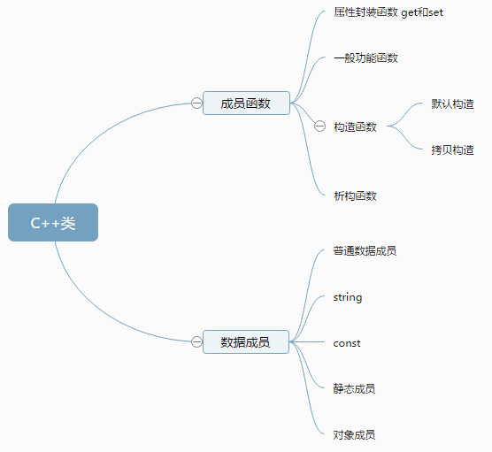

# 类和对象
C++ 在 C 语言的基础上增加了面向对象编程，C++ 支持面向对象程序设计。类是 C++ 的核心特性，通常被称为用户定义的类型。
类用于指定对象的形式，它包含了数据表示法和用于处理数据的方法。类中的数据和方法称为类的成员。函数在一个类被称为类的成员。



## 定义
定义一个类，本质上是定义一个数据类型的蓝图。
这实际上并没有定义任何数据，但它定义了类的名称意味着什么，也就是说，它定义了类的对象包括了什么，以及可以在这个对象上执行哪些操作。
类定义是以关键字 class 开头，后跟类的名称。类的主体是包含在一对花括号中。
类定义后必须跟着一个分号或一个声明列表。例如，我们使用关键字 class 定义 Box 数据类型，如下所示：
```cpp
#include "stdafx.h"
#include "string"
#include "iostream"
using namespace std;

class Box
{
public://公有成员
	//长度
	double length;
	//宽度
	double width;
	//高度
	double height;

	//计算体积
	double GetVolume() {
		return height*width*length;
	};

	//获取表面积
	double GetArea();

protected://受保护成员
	//颜色
	string color;

private://私有成员
	//材质
	string material;
};

//Box的派生类BigBox
class BigBox :public Box {
};

double Box::GetArea() {
	return (length*width + length*height + width*height) * 2;
};

int main()
{
	Box box1;//对象box1，从栈实例化对象

	Box *pBox = new Box();//从堆实例化对象

	//栈上对象使用点【.】
	box1.length = 10;
	box1.width = 5;
	box1.height = 3;

	//堆上对象
	pBox->length = 100;
	pBox->width = 50;
	pBox->height = 30;


	cout << "盒子体积：" << box1.GetVolume() << endl;
	cout << "盒子表面积：" << box1.GetArea() << endl;

	cout << "//////////////////////////////////////////////////////////////////////////" << endl;

	cout << "pbox盒子体积：" << pBox->GetVolume() << endl;
	cout << "pbox盒子表面积：" << pBox->GetArea() << endl;

	cout << "//////////////////////////////////////////////////////////////////////////" << endl;

	BigBox bigBox1;

	//继承了父类的属性
	bigBox1.length = 3;
	bigBox1.width = 2;
	bigBox1.height = 1;
	
	system("pause");

	return 0;
}
```

## 环形队列的实现
MyQueue.cpp
```cpp
#include "iostream"
#include "MyQueue.h"
using namespace std;

MyQueue::MyQueue(int queueCapacity)
{
	m_iQueueCapacity = queueCapacity;
	ClearQueue();

	m_pQueue = new int[queueCapacity];
}

MyQueue::~MyQueue()
{
	delete[]m_pQueue;
	m_pQueue = NULL;
}

void MyQueue::ClearQueue()
{
	m_iHead = 0;
	m_iTail = 0;
	m_iQueueLen = 0;
}

bool MyQueue::QueueEmpty() const
{
	return m_iQueueLen == 0;
}

bool MyQueue::QueueFull() const
{
	return m_iQueueLen == m_iQueueCapacity;
}

int MyQueue::QueueLength() const
{
	return m_iQueueLen;
}

bool MyQueue::EnQueue(int element)
{
	if (QueueFull())
	{
		return false;
	}
	m_pQueue[m_iTail] = element;
	m_iTail++;
	m_iTail = m_iTail % m_iQueueCapacity;

	m_iQueueLen++;
	return true;
}

bool MyQueue::DeQueue(int &element)
{
	if (QueueEmpty())
	{
		return false;
	}
	element = m_pQueue[m_iHead];
	m_iHead++;
	m_iHead = m_iHead % m_iQueueCapacity;
	m_iQueueLen--;
	return true;
}

void MyQueue::QueueTraverse()
{
	cout << "=================start=======================" << endl;
	for (int i = m_iHead; i < m_iHead + m_iQueueLen; i++)
	{
		cout << m_pQueue[i % m_iQueueCapacity] << endl;
	}
	cout << "=================end========================" << endl;
}

```
MyQueue.h
```cpp
#pragma once
class MyQueue
{
public:
	/*MyQueue();
	~MyQueue();*/
	MyQueue(int queueCapacity); // 构造函数，创建队列
	virtual ~MyQueue();//析构函数，销毁队列
	void ClearQueue();//清空队列
	int QueueLength() const;//
	bool QueueEmpty() const;//判空队列
	bool QueueFull() const;//判断是否满了
	bool EnQueue(int element);//
	bool DeQueue(int &element);//
	void QueueTraverse();//遍历队列
private:
	int *m_pQueue;//队列数组指针
	int m_iQueueLen;//队列元素个数
	int m_iQueueCapacity;//队列数组容量
	int m_iHead;//队头
	int m_iTail;//队尾

};

```
Program.cpp
```cpp
#include "iostream"
#include "MyQueue.h"
using namespace std;

void main() {
	MyQueue *p = new MyQueue(4);
	p->EnQueue(0);
	p->EnQueue(1);
	p->EnQueue(2);
	p->EnQueue(3);

	int ele;
	p->DeQueue(ele);
	p->DeQueue(ele);
	p->DeQueue(ele);

	p->EnQueue(4);
	p->EnQueue(5);

	p->QueueTraverse();

	system("pause");

}
```

## 构造函数
### 构造函数的重载
### 初始化列表
### 拷贝构造函数

## 析构函数
```cpp
#include "stdafx.h"
#include <iostream>
#include "string"

using namespace std;

class Student
{
public:
	Student();//默认构造函数
	Student(string name);//重载，带参数构造函数
	Student(const Student &stu);//拷贝的构造函数
	Student(string name, int age);//自动绑定列表

	~Student();//析构函数，释放资源

	void SetName(string name);
	void GetName();
private:
	string m_Name;
	int m_Age;
};

//默认构造函数
Student::Student()
{
	cout << "默认构造函数" << endl;
};

//构造函数重载，有参数的构造函数
Student::Student(string name)
{
	m_Name = name;
	cout << "带参数的构造函数" << endl;
}

Student::Student(string name, int age) :m_Name(name), m_Age(age)
{
	cout << "自动绑定列表发生在构造函数之前！" << endl;
}

//析构函数
Student::~Student()
{
	cout << "析构函数，对象销毁时自动调用，释放资源" << endl;
}

//拷贝构造函数
Student::Student(const Student & stu)
{
	cout << "拷贝对象" << endl;
}

void Student::SetName(string name)
{
	m_Name = name;
}

void Student::GetName()
{
	cout << m_Name << endl;
}

//栈上实例化对象，会自动调用析构函数自动释放
void GetStudentStack();

//堆上实例化对象，并不会自动调用析构函数释放资源
void GetStudentHeap();

void main() {
	Student stu("Jack");
	stu.GetName();

	Student *pStu = new Student("Lucy");
	pStu->GetName();

	Student stu1 = stu;
	cout << "//////////////////////////////////////////////////////////////////////////" << endl;

	Student *pStuAge = new Student("秦始皇", 54);
	pStuAge->GetName();
	delete pStuAge;
	pStuAge = NULL;
	cout << "//////////////////////////////////////////////////////////////////////////" << endl;

	cout << "栈上实例化：" << endl;
	GetStudentStack();
	cout << "//////////////////////////////////////////////////////////////////////////" << endl;

	cout << "堆上实例化：" << endl;
	GetStudentHeap();
	cout << "//////////////////////////////////////////////////////////////////////////" << endl;

	system("pause");
}

void GetStudentStack() {
	Student stu;
}

void GetStudentHeap() {
	Student *pStu = new Student();

	//需要手动释放
	delete pStu;
	pStu = NULL;
}
```

## 对象数组
```cpp
class Student {
public:
	Student();
	~Student();
	string Name;
	int Age;
};

Student::Student()
{
}

Student::~Student()
{
}

void main() {
	const int LEN = 3;

	//栈上 数组
	Student stus[LEN];
	stus[0].Name = "赵大力";
	stus[0].Age = 1;

	//堆上 数组
	Student *pStus = new Student[LEN];

	/*第一个元素*/
	pStus->Name = "赵二狗";
	pStus[0].Age = 1;

	/*第二个元素*/
	pStus++;
	pStus->Name = "钱多多";
	pStus[0].Age = 2;

	for (int i = 0; i < LEN; i++)
	{
		cout << "第" << i << "个元素：" << stus[i].Name << endl;
	}

	//指针方式遍历就比较麻烦了，先让指针指向第一个元素，通过下标访问，不再改变指针
	pStus--;
	for (int i = 0; i < LEN; i++)
	{
		cout << "指针：第" << i << "个元素：" << pStus[i].Name << endl;
	}

	delete[]pStus;
	pStus = NULL;

	system("pause");
}
```