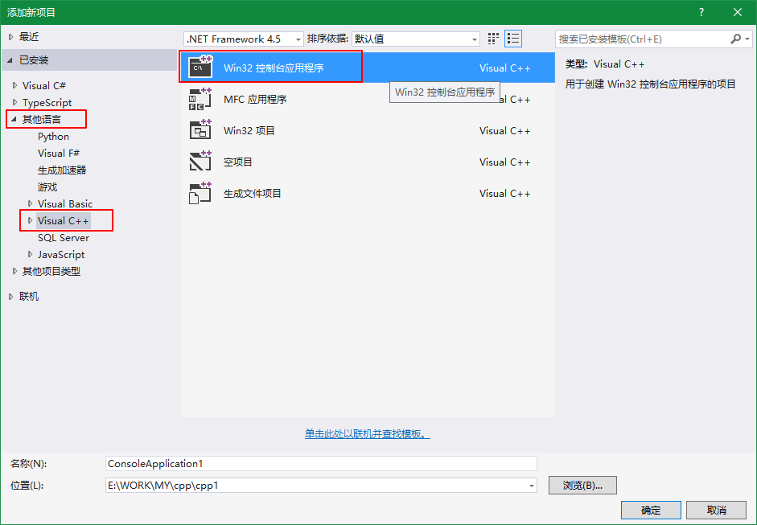
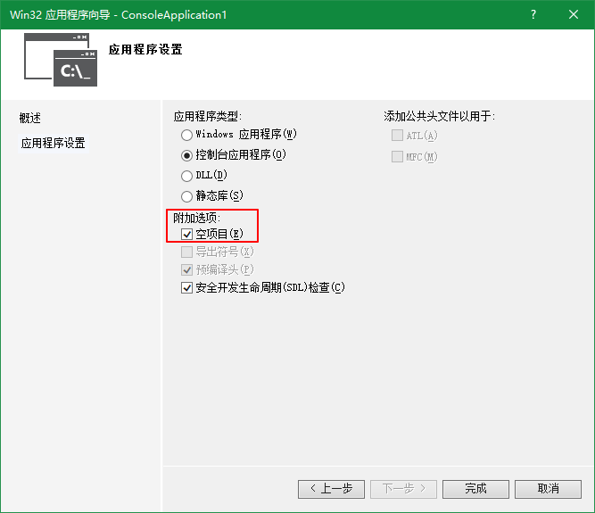
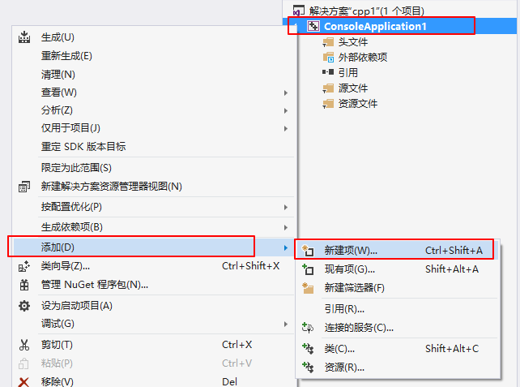
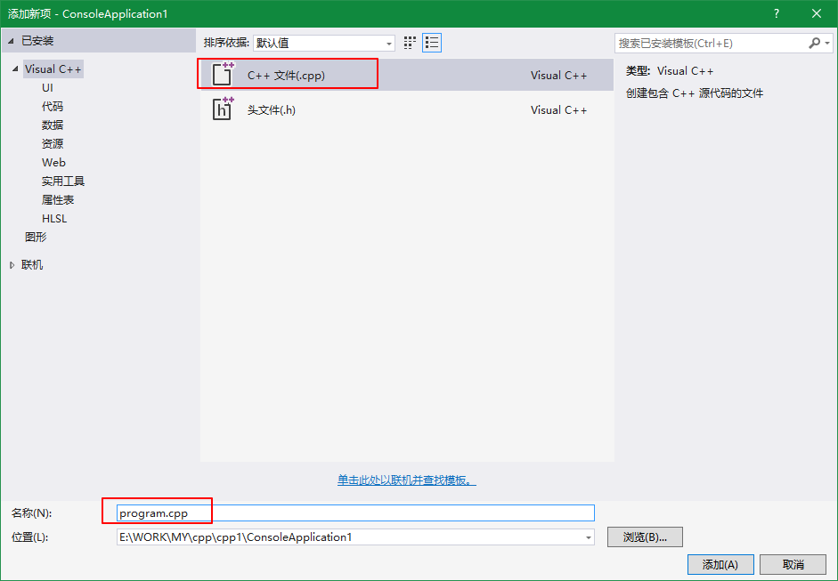
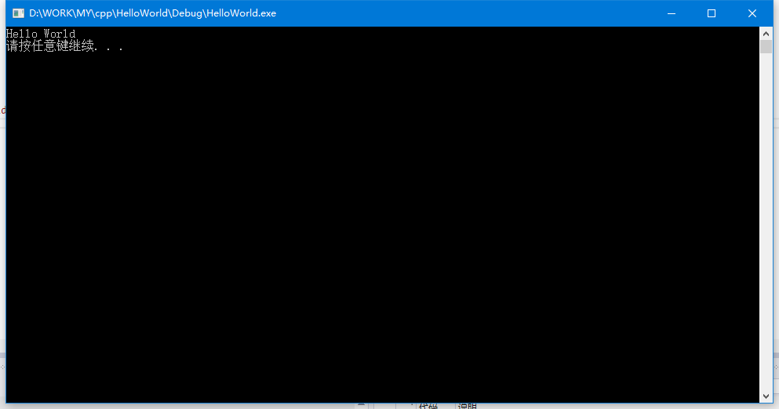
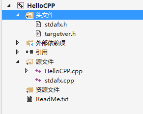

<!-- TOC -->

- [HelloWorld](#helloworld)
    - [新建项目和C++文件](#新建项目和c文件)
    - [入口函数](#入口函数)
    - [默认结构](#默认结构)
        - [stdafx](#stdafx)
        - [targetver](#targetver)

<!-- /TOC -->

<a id="markdown-helloworld" name="helloworld"></a>
# HelloWorld
环境：WIN10 IDE-VS2015
<a id="markdown-新建项目和c文件" name="新建项目和c文件"></a>
## 新建项目和C++文件
文件-新建项目，选择Visual C++模板，win32控制台程序，如下图所示：



选择空项目：



新建项：



添加一个C++文件，作为控制台程序入口文件：



<a id="markdown-入口函数" name="入口函数"></a>
## 入口函数
方法main() 是入口函数，添加如下代码：
```cpp
#include "stdlib.h"
#include <iostream>

using namespace std;

int main()
{
	cout << "Hello World" << endl;

	system("pause");
	return 0;
}
```

F5执行该程序，呈现如下效果：




<a id="markdown-默认结构" name="默认结构"></a>
## 默认结构
创建项目时，若未勾选空项目，默认结构为：



<a id="markdown-stdafx" name="stdafx"></a>
### stdafx
英文全称为：Standard Application Framework Extensions（标准应用程序框架的扩展）

所谓头文件预编译，就是把一个工程(Project)中使用的一些MFC标准头文件(如Windows.H、Afxwin.H)预先编译，以后该工程编译时，不再编译这部分头文件，仅仅使用预编译的结果。这样可以加快编译速度，节省时间。

直白的说，【stdafx.h】文件就是用于包含经常使用但不常更改的头文件。在cpp文件中进行include【stdafx.h】文件，不建议在h头文件中进行include。

<a id="markdown-targetver" name="targetver"></a>
### targetver

