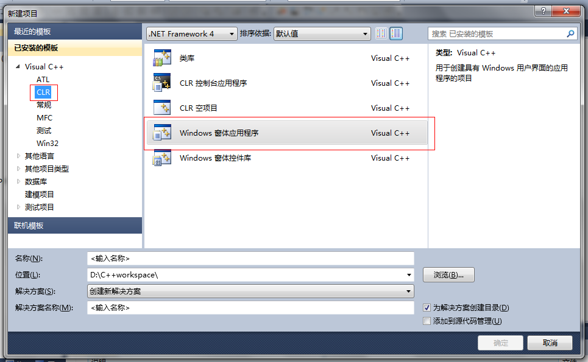
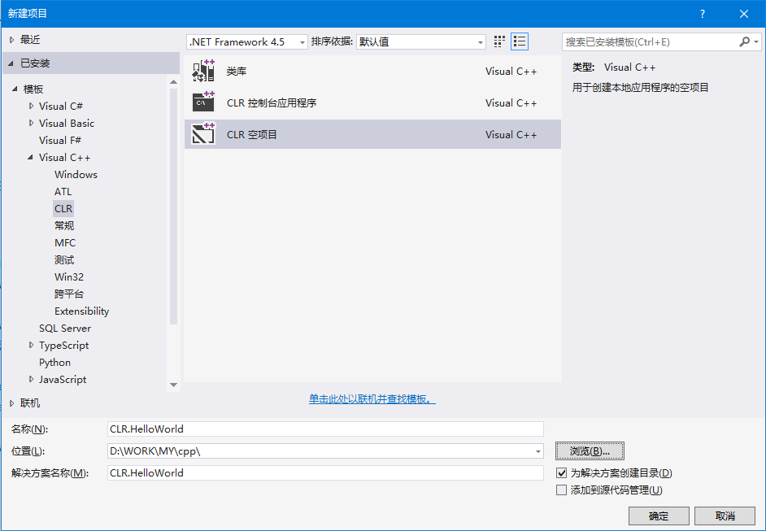
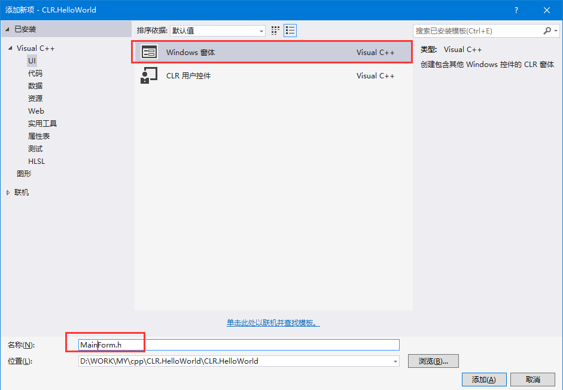
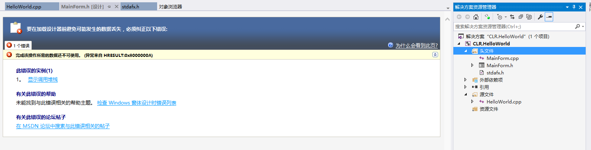
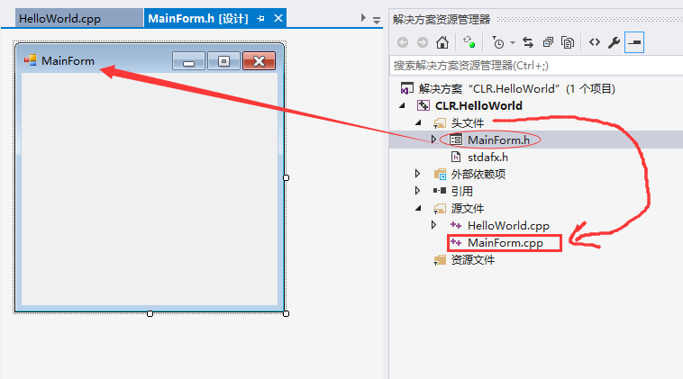
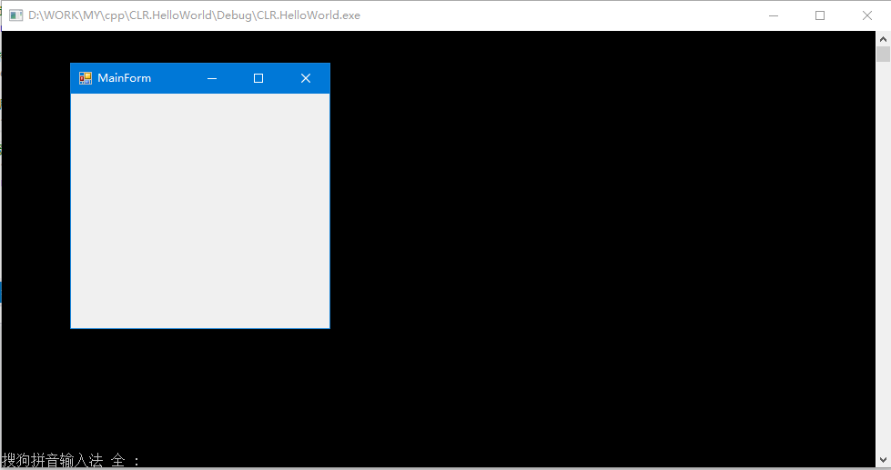
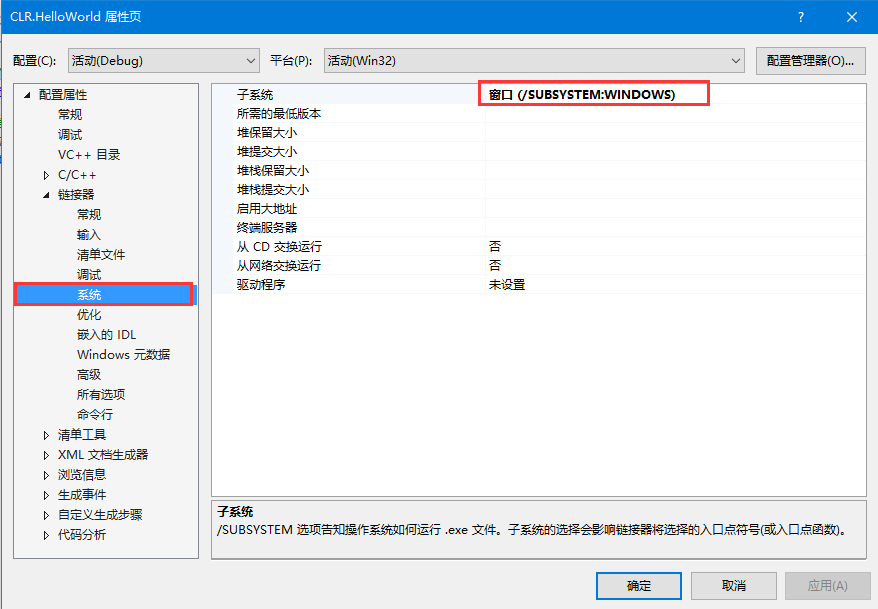
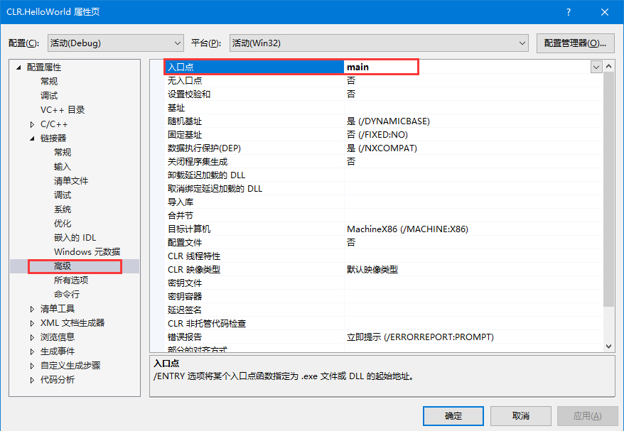

<!-- TOC -->

- [CLR HelloWorld](#clr-helloworld)
    - [项目构建](#项目构建)
        - [新建项目](#新建项目)
        - [stdafx.h](#stdafxh)
        - [添加窗体](#添加窗体)
        - [入口函数](#入口函数)
        - [显示效果](#显示效果)

<!-- /TOC -->

<a id="markdown-clr-helloworld" name="clr-helloworld"></a>
# CLR HelloWorld
VS2010以及以前的版本，创建项目时都可以在CLR下找到“Windows窗体应用程序”的项目模板，但是VS2012以后的版本就没这么方便了。



可以通过打开旧版本的项目来修改，也可以像下面这样操作：

<a id="markdown-项目构建" name="项目构建"></a>
## 项目构建
环境：WIN10 IDE-VS2015

<a id="markdown-新建项目" name="新建项目"></a>
### 新建项目
选择Visual C++/CLR模板，新建一个CLR空项目



<a id="markdown-stdafxh" name="stdafxh"></a>
### stdafx.h
添加 stdafx.h 头文件，代码如下：
```cpp
// stdafx.h : 标准系统包含文件的包含文件，
// 或是经常使用但不常更改的
// 特定于项目的包含文件
#pragma once

// TODO: 在此处引用程序需要的其他头文件
#include <iostream>
#include <string>
```

Standard Application Framework Extensions-标准应用程序框架的扩展。
所谓头文件预编译，就是把一个工程(Project)中使用的一些MFC标准头文件(如Windows.H、Afxwin.H)预先编译，以后该工程编译时，不再编译这部分头文件，仅仅使用预编译的结果。这样可以加快编译速度，节省时间。

<a id="markdown-添加窗体" name="添加窗体"></a>
### 添加窗体
右键点击头文件，添加新建项，选择windows 窗体



添加完成后设计视图在vs2015上显示有问题，不用担心，保存后重新打开MainForm设计视图即可。



将自动生成对应的cpp文件(MainForm.cpp)移动到源文件中，如下图所示



<a id="markdown-入口函数" name="入口函数"></a>
### 入口函数
添加 HelloWorld.cpp 文件，编码实现入口函数：
```cpp
#include "stdafx.h"
#include "MainForm.h"

//使用MainForm.h 代码中的命名空间
using namespace CLRHelloWorld;

//单线程特性，有些组件要求单线程
[STAThreadAttribute]
int main(array<System::String^>^args) {
	// 在创建任何控件之前启用 Windows XP 可视化效果
	Application::EnableVisualStyles();
	Application::SetCompatibleTextRenderingDefault(false); 

	//创建主窗口并运行它
	Application::Run(gcnew MainForm());
	return 0;
}
```

<a id="markdown-显示效果" name="显示效果"></a>
### 显示效果
选择 调试-开始执行(不调试) ，再显示MainForm窗体的同时，还有一个控制台窗口



修改项目属性：
【配置属性-链接器-系统-子系统】 选项，修改为窗口【窗口 (/SUBSYSTEM:WINDOWS)】



【配置属性-链接器-高级-入口点】选项，修改为对应的入口函数【main】


Ctrl+F5 查看效果 OK